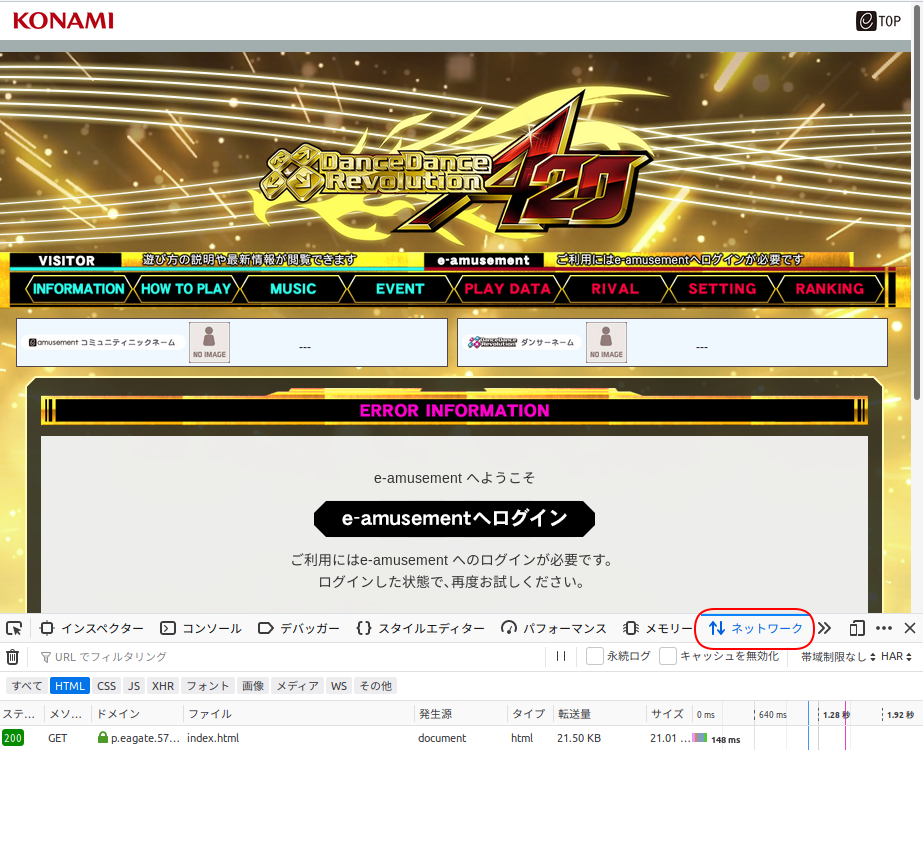
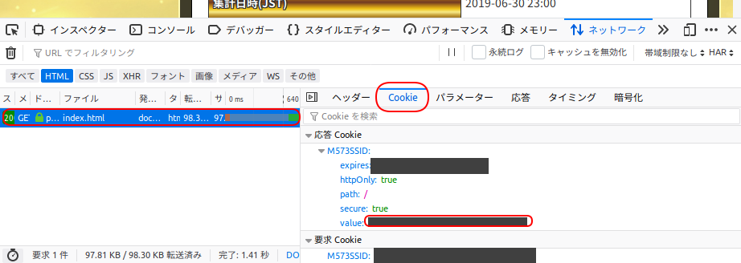

# ゴールデンリーグ ボーダー取得 クローラー

DDRのゴールデンリーグのボーダー情報([Webページ(要ログイン)](https://p.eagate.573.jp/game/ddr/ddra20/p/ranking/index.html)) を取得するクローラーです。  

## 動作環境

* python 3
* pip
* Google Chrome (or chromium)
* [ChromeDriver](http://chromedriver.chromium.org/home)
* git

## 初期設定

任意のディレクトリにこのリポジトリをcloneします。  

```bash
git clone https://github.com/iga-c/ddr_golden_league_crawler.git
```

必要なライブラリをpipでインストールします。  

```bash
pip install -r requirements.txt
```

configファイルをコピーし、必要な項目を埋めます。  

```bash
cp config.yml.tmp config.yml
vi config.yml
```

| キー名 | 設定内容 |
| --- | --- |
| cookie_value | DDRの公式サイトでログイン後にセットされているcookieで`M573SSID`のキーに対応した値(※) |
| binary_location | GoogleChromeのバイナリが保存されているPATH headless-chrome等を使用しない場合は空欄 |
| webdriver_path | ChromeDriverのPATH |
| consumer_key | Twitter APIのconsumer_key 使用しない場合は空欄 |
| consumer_secret | Twitter APIのconsumer_key_secret 使用しない場合は空欄 | 
| token | Twitter APIのtoken 使用しない場合は空欄 | 
| token_secret | Twitter APIのtoken secret 使用しない場合は空欄 |
| retry_count | クロール失敗時に取得し直す回数 |

(※) ページ下部にクッキーの値の確認方法が記載されています。

run.pyを実行すると結果をツイートします。  

```bash
python run.py
```

## 使用方法

### import方法

crawler.pyを使用する実行ファイルと同一の階層に保存し、下記のimport文を記載します。  

```python
from crawler import GoldenLeagueCrawler
```

### GoldenLeagueCrawlerインスタンスの生成とクロール処理の実行

import後、GoldenLeagueCrawlerインスタンスを生成してクロールを実行します。

```python
f = open("config.yml", "r+")
data = yaml.safe_load(f)
crawler = GoldenLeagueCrawler(data["cookie_value"], data["webdriver_path"], '' if data["binary_location"] is None else data["binary_location"], data["retry_count"])
crawler.crawl()
```

### ボーダー結果の取得

クロールを行ったインスタンスに対し、下記の変数にアクセスすることで結果を取得することが出来ます。  

```python
crawler.gold_l_border # ゴールドクラスの降格ボーダー string型
crawler.silver_u_border # シルバークラスの昇格ボーダー string型
crawler.silver_l_border # シルバークラスの降格ボーダー string型
crawler.bronze_u_border # ブロンズクラスの昇格ボーダー string型
crawler.time_text # ボーダー更新時刻 string型
crawler.tweet_text() # ツイート用に結果を整形した文字列 string型
```

run.pyに最小限の使用方法を記載しています。参考にしてください。  

## スリープ秒数について

sleepの秒数は減らさないでください。過度な負荷をサーバーにかけないようにお願い致します。  

## クッキーの値確認方法

FireFoxで([ランキングページ](https://p.eagate.573.jp/game/ddr/ddra20/p/ranking/index.html))を開いた後に、`F12キー`を押して開発者ツールを表示します。  
開発者ツールを表示後、`ネットワーク`タブをクリックします。  

  

ネットワークタブを開いた後、ログインし再度ランキングページを表示します。  
ページ表示後、開発者ツールのファイル欄に`index.html`と表示されている箇所をクリックします。  
クリックすると右側に`cookie`タブが表示されるので、`cookie`タブをクリックします。  
`応答cookie`の`M573SSID`の`value`にて表示されている文字列を`config.yml`の`cookie_value`に設定します。  
また、この値が漏れると第三者が貴方のKONAMIアカウントを悪用することができる為、注意して使用してください。  

  
